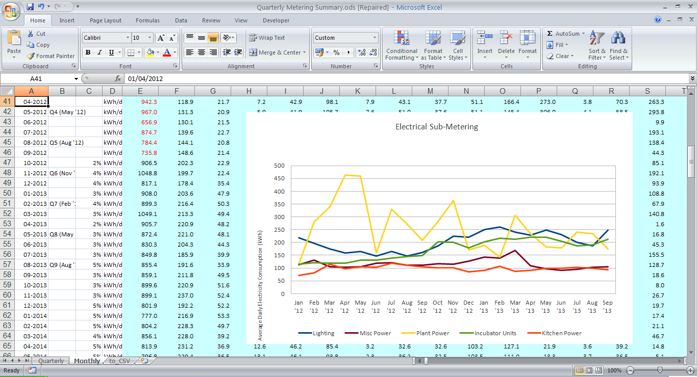
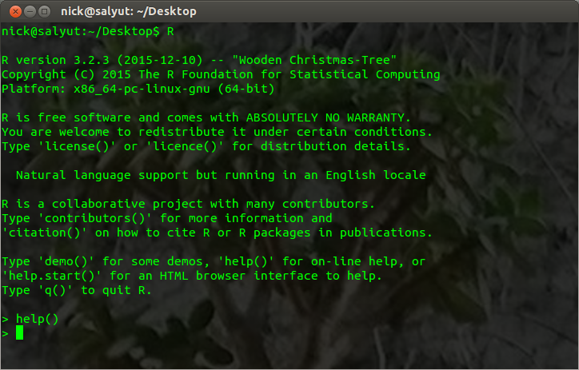
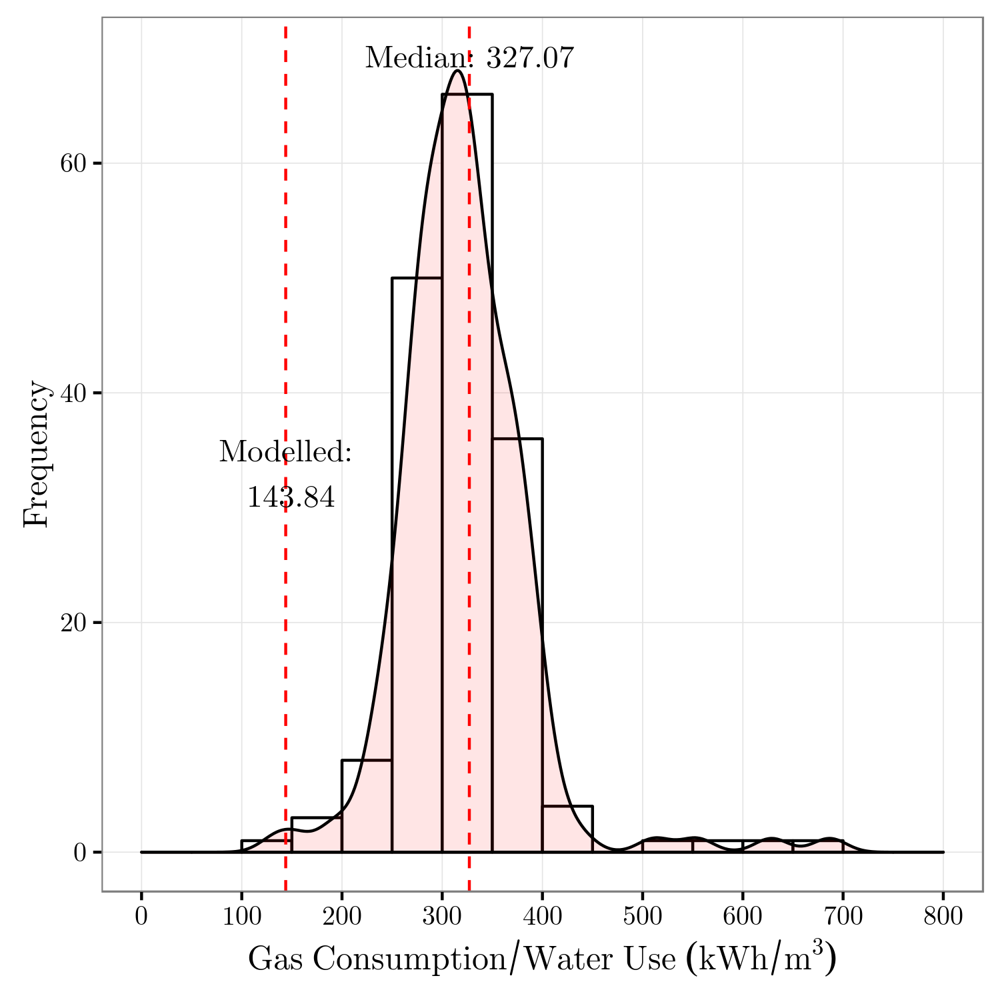
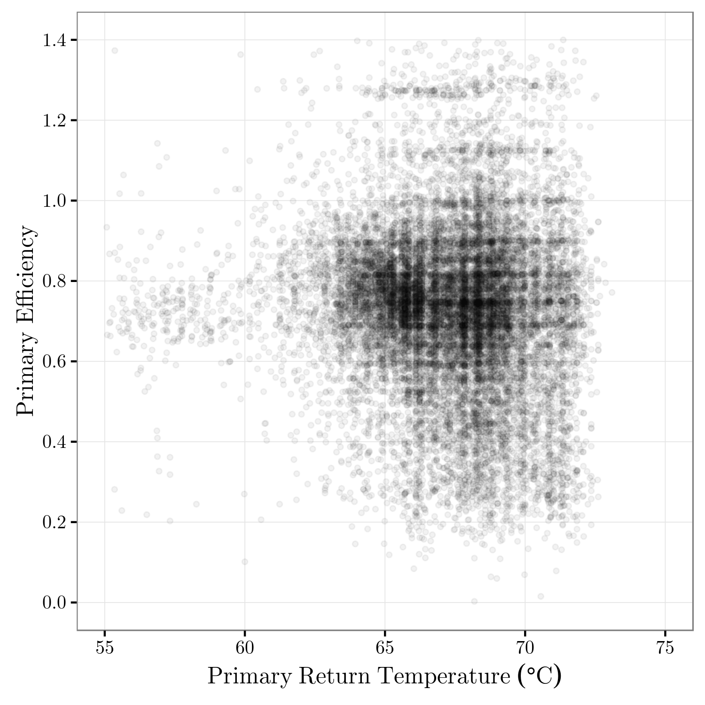
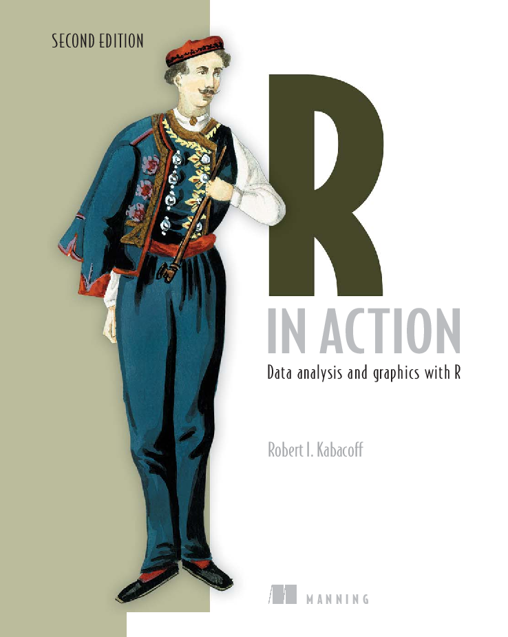

```{r setup, echo=FALSE, message=FALSE}
# Load in a few useful packages
library(ggplot2)
library(plyr)
library(corrplot)
library(maptools)
library(rgl)
library(knitr)

knit_hooks$set(webgl = hook_webgl)
```

## Contents

* What is this R thing anyway?
* Why I use it, and why you might too
* What sort of things can you do with it?
* How to start on your own journey

*** =pnotes

press 'p' to show presenter notes<br />
press 'w' to toggle widescreen layout<br />
press 'o' to toggle transition style<br />
press 'f' to toggle fullscreen<br />
press 'g' to go to slide<br />
press 't' to show slide links<br />
press '@' to quick find links<br />
press '?' to quick find<br />

--- .quote

## What is R?

<q>R is a language and environment for statistical computing and graphics.</q>

*** =pnotes

R is also:
* Cross platform (Windows, MacOS, Linux)
* Free Software (GNU General Public License)
* "Quite Good"

---

## Life Before R

<div style='text-align: center;'>
  
</div>

*** =pnotes

Working with Excel and LibreOffice became quite a chore.

---

## Then

<div style='text-align: center;'>
  
</div>

*** =pnotes

I discovered R, in all its command line glory.

---

## Finally

<div style='text-align: center;'>
  
</div>

*** =pnotes

I began using RStudio and haven't looked back since. 

---

## What I Discovered

* Scriptable data manipulation and analysis
* Statistical analysis in just a few lines of code
* Sophisticated, publication-ready plots
* Reproducible research with HTML and LaTeX

---

## Caveats

Like many things in life, you get out what you put in. The learning curve may be steep\* at first, but perseverance pays dividends. In particular, it's worth remembering that:

* R is not a spreadsheet; get used to not seeing columns of numbers
* R is not GUI driven; get used to typing (and having more control)
* R is not a tidy language; get used to idiosyncrasy (or stick with Python)

<span class="footnote">\* or should that be 'shallow' ;)</span>

--- {class: segue, bg: white}

## Let's Take a Look

--- &twocol

## The Basics

*** =left

```{r basics}
# assignment
x <- 5

x + 1

# functions
f <- function (x){
  x^2 - 3*x - 12
}

f(5)
```

*** =right

<center>
  
</center>

*** =fullwidth

Fantastic, so R makes handy replacement for your vintage pocket calculator!

---

## Vectorisation

Users coming from other C-like languages may have a tendency to use loops for array operations.

```{r}
# Suppose we want to obtain the sum of the logs of a vector of numbers, variable x
x <- 1:10      # assign the sequence 1 to 10 to x

# Vectorisation means we don't have to mess around with shit like this:
lsum <- 0
for(i in 1:length(x)) {
  lsum <- lsum + log(x[i])
}
lsum
```

---

## Vectorisation

R, like Matlab, has a much quicker and neater way of dealing with this kind of thing. 

```{r}
log(x)         # returns a vector containing the log of each element of x
sum(log(x))    # returns single element vector containing the sum of the logs of x
```

Most functions in R are vectorised in some way; they either perform the same operation on each element of vector of values or operate on the whole vector.

---

## Built-In Datasets

R comes with many built-in datasets to experiment with. The `mtcars` dataset was extracted from the 1974 Motor Trend US magazine, and comprises fuel consumption and 10 aspects of automobile design and performance for 32 automobiles.

```{r}
# let's see the structure of the first four variables in the dataset
str(mtcars[1:4]) 
```

So what's this `data.frame` thing? A dataframe is a two-dimensional matrix whose columns may be of differing data types (numeric, logical, character, etc.). It's the closest you're going to get to a familiar spreadsheet...

---

## Summary Statistics

```{r}
# mean, median, 25th and 75th quartiles, min, max
summary(mtcars[1:4])

# standard deviation
sapply(mtcars[1:4], sd, na.rm=TRUE)
```

---

## Simple Plots

```{r fig.align='center', fig.height=5.5, fig.width=5.5, out.height='396px'}
plot(x = mtcars$disp, y = mtcars$mpg,
     main = "Relationship between\nengine size and fuel economy",
     xlab = "Displacement (cu.in.)", ylab = "Miles / (US) Gallon")
```

---

## Linear Regression

```{r}
model <- lm(mpg ~ disp, data = mtcars)
summary(model)
```

--- &twocol

## Loading CSV Data

*** =left

```{r, fig.height=5.5, fig.width=6.5, out.height='396px', fig.align='center'}
data <- read.csv("weather_data.csv")

# simple line plot of dry-bulb temperature
plot(data$DBT, type = "l")
```

*** =right

```{r}
# annual average dry-bulb temperature
mean(data$DBT)

# average dry-bulb temperature for August
mean(data$DBT[data$month == 8])
```

But what about summarising for all months? There are a number of ways to do this; `aggregate` was the first one I learnt.

--- &twocol

## Summarising Data

*** =left

```{r}
aggregate(list(DBT = data$DBT),
          by = list(Month = data$month),
          FUN = mean, na.rm = TRUE)
```

*** =right

```{r, echo=FALSE}
monthly <- aggregate(list(DBT = data$DBT), by = list(Month = data$month), FUN = mean, na.rm = TRUE)
month_labels <- c("Jan", "Feb", "Mar", "Apr", "May", "Jun", "Jul", "Aug", "Sep", "Oct", "Nov", "Dec")
```

```{r fig.align='center', fig.height=5.5, fig.width=7, out.height='396px'}
barplot(monthly$DBT,
    names.arg = month_labels,
    ylim = c(0, 20),
    main = "Monthly Average Temperatures")
```

---

## Additonal Packages

There are over 7000 packages available from a central repository, ranging from "Artificial Bee Colony (ABC) Optimization" to "Zero-Inflated Models for Count Time Series". Packages are browsable by topic on the CRAN website <https://cran.rstudio.com/web/views/>. Additional packages may be downloaded (e.g. from Github) and compiled (with varying degrees of difficulty).

* ggplot2 - An Implementation of the Grammar of Graphics
* knitr - A General-Purpose Package for Dynamic Report Generation in R
* maptools - Tools for Reading and Handling Spatial Objects
* openxlsx - Read, Write and Edit XLSX Files
* plyr - Tools for Splitting, Applying and Combining Data
* RMySQL - Database Interface and 'MySQL' Driver for R
* RNetica - R interface to Netica(R) Bayesian Network Engine
* slidify - Generate reproducible html5 slides from R markdown
* tikzDevice - R Graphics Output in LaTeX Format

--- {class: segue, bg: white}

## Example Plots

--- &twocol

## Box Plots and Histograms

*** =left
  <br />
  Plot annotated with median values and sample sizes.
  
*** =right
  <br />
  Histogram overlaid with semi-transparent density curve.

--- &twocol

## Scatterplots and Time Series

*** =left
  
  Point colour and size are mapped to additional data variables.

*** =right
  <br />
  Position of annotations and coloured regions derived automatically from data.

--- &twocol

## Transparent Point Scatterplots

*** =left

  
*** =right


*** =fullwidth
Semi-transparent points were used to reveal a distribution in the data that's obscured by solid points.

---

## Facet Plots (Small Multiples)

```{r echo=FALSE, message=FALSE, warning=FALSE, fig.align='center', fig.height=6, fig.width=10, out.height='540px'}

ggplot(diamonds, aes(x = carat, y = price, color = color)) +
  geom_point() + labs(x = "Price", y = "Carat") +
  scale_x_log10(breaks = c(0.25, 0.5, 1, 2, 4)) +
  scale_colour_brewer(type = "qual", palette = "Set1", name = "Colour") +
  facet_grid(cut~clarity) +
  theme_bw() +
  theme(axis.text.x = element_text(angle = -90, vjust = 0.5, hjust = 1)) +
  theme(strip.text.y = element_text(angle = -90)) +
  theme(panel.grid.minor = element_blank()) +
  theme(text = element_text(family = "CMU Serif"))
```

---

## Correlation Plots

```{r fig.align='center', fig.height=5.5, fig.width=5.5, out.height='396px'}
# Generate correlation plot for the mtcars data set
corrplot(cor(mtcars))
```

---

## Contour Plots

```{r fig.align='center', fig.height=6, fig.width=6, out.height='432px'}
# Generate an image from a matrix of elevation data
image(x = c(1:87), y = c(1:61), volcano, ylab = "Y Coordinate (10m)", xlab = "X Coordinate (10m)")
# Add the contour lines 
contour(x = c(1:87), y = c(1:61), volcano, add = TRUE)
```

---

## Geospatial Data

R has (surprise surprise) numerous packages for analysis of spatial data. See: <https://cran.r-project.org/web/views/Spatial.html> for more details.

```{r setup_map, echo=FALSE, message=FALSE}
# Load the shapefile
UK_shapefile <- readShapePoly("assets/data/GBR_adm0.shp")

# Convert the shapefile to a dataframe
UK_shapefile <- fortify(UK_shapefile)

# Give the columns prettier names:
UK_shapefile$Latitude <- UK_shapefile$lat
UK_shapefile$Longitude <- UK_shapefile$long
UK_shapefile <- UK_shapefile[,!(names(UK_shapefile) %in% c("lat","long"))]

# Set the plot theme
plotdefaults <- list(theme_bw(),
                     theme(axis.text.x = element_text(angle = 90, vjust = 0.5, hjust = 1)),
                     theme(panel.grid.minor = element_blank()),
                     theme(text = element_text(family = "CMU Serif")))
```

```{r plot_map, fig.align='center', fig.height=5.5, fig.width=5.5, out.height='396px'}
ggplot(UK_shapefile, aes(x = Longitude, y = Latitude, group = group)) + geom_path() + plotdefaults
```

---

## 3D Scatterplots

```{r testgl, webgl=TRUE, cache=FALSE, cache.rebuild=TRUE}
x <- sort(rnorm(1000))
y <- rnorm(1000)
z <- rnorm(1000) + atan2(x,y)
plot3d(x, y, z, col=rainbow(1000))
```

---

## Easter Egg

```{r easter_egg, webgl = TRUE, echo = FALSE, cache=FALSE, cache.rebuild=TRUE}
meshgrid <- function(a, b) {
  list(x = outer(b * 0, a, FUN = "+"), y = outer(b, a * 0, FUN = "+"))
}

c = 0.2
b = 1.7
theta = seq(0, 2 * pi, length = 40 * 4)
phi = seq(0, pi, length = 40 * 4)
theta1 = meshgrid(theta, phi)$x
phi2 = meshgrid(theta, phi)$y
x = (1 + c * phi2) * sin(phi2) * cos(theta1)
y = (1 + c * phi2) * sin(phi2) * sin(theta1)
z <- b * cos(phi2)

rgl.close()
surface3d(x, y, z, color = rainbow(20))
par3d(zoom = 0.7)
```

--- {class: segue, bg: white}

## It's Your Turn

---

## Getting Started

The first step in your journey of a thousand miles is the easiest.

Download and install:

 R for Windows/OSX/Linux <https://cran.rstudio.com/>

  RStudio <https://www.rstudio.com/products/rstudio/download/>

---

## Getting Lost

Sometimes we all need a helping hand; someone who's trudged through the same mire.

 stack<b>overflow</b> <http://stackoverflow.com/questions/tagged/r>

R-help Mailing List <https://stat.ethz.ch/mailman/listinfo/r-help>

Of the two, stack<b>overflow</b> is probably the friendliest. While R-help can be a good way of getting help from seasoned R experts and developers, naïve questioners are likely to get slapped around a bit.
  
 <http://www.r-bloggers.com/>

The R-bloggers site aggregates content from over 500 R-related blogs. It's great for news, tutorials and general <span class='italic'>"I never realised you could do that with R"</span> inspiration.

---

## Getting Read

A good book is also handy. The following have my recommendation:




* Chang, W. 2012 - R Graphics Cookbook
* Matloff, N. 2011 - The Art of R Programming
* Kabacoff, R. 2015 - R in Action

--- .listsmall

## Thanks for listening

Is there any cake left?


* Presentation available online <http://ndoylend.github.io/R_Intro/>
* Built with Slidify <https://github.com/ramnathv/slidify>
